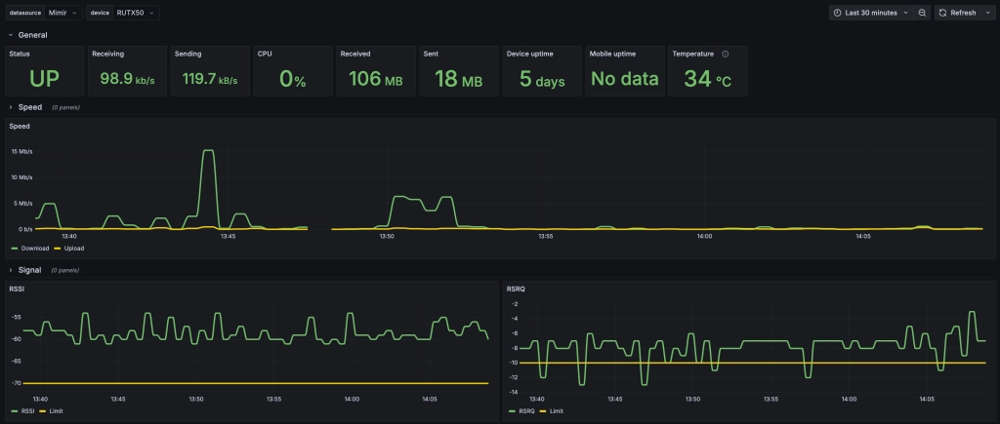

# Teltonika exporter

This is a simple exporter for Teltonika devices. It should work with any Teltonika device that implements Teltonika Web
API. It can monitor multiple devices at the same time.

## Usage

```bash
$ ./teltonika-exporter --help
A simple exporter for Teltonika devices, exposing metrics to Prometheus.

Usage:
  teltonika-exporter [flags] <config_file>

Examples:
teltonika-exporter --port 15741

Flags:
  -c, --config string   Config file path
  -h, --help            help for teltonika-exporter
      --port int        Exporter port (default 15741)
```

## Configuration file

```yaml
devices:
  - name: "RUTX50"                          # device name used in instance label (optional - host is used by default)
    schema: "https"                         # scraping schema (optional - https is used by default)
    host: "192.168.1.1"                     # device IP address
    timeout: "5s"                           # timeout for scraping (optional - 10s is used by default)
    username: "admin"                       # device username
    password: "admin"                       # device password
    collect: [ "system", "modem", "dhcp" ]  # list of metrics to collect - check the list above
```

You can find more detailed information about the configuration in the [example config file](./deb/config.yaml).

## Grafana dashboard



## Tested devices

- RUTX50
- TAP200
- RUT240

## References
- [Teltonika Web API](https://developers.teltonika-networks.com/)