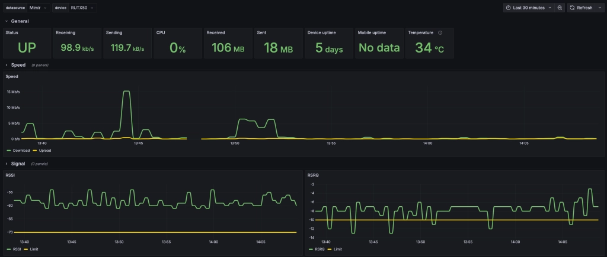

# Teltonika exporter

This is a simple exporter for Teltonika devices. It should work with any Teltonika device that implements Teltonika Web
API. It can monitor multiple devices at the same time.

## Usage

```bash
$ ./teltonika-exporter --help
A simple exporter for Teltonika devices, exposing metrics to Prometheus.

Usage:
  teltonika-exporter [flags] <config_file>

Examples:
teltonika-exporter --port 15741

Flags:
  -c, --config string   Config file path
  -h, --help            help for teltonika-exporter
      --port int        Exporter port (default 15741)
```

## Configuration file

```yaml
devices:
  - name: "RUTX50"                          # device name used in instance label (optional - host is used by default)
    schema: "https"                         # scraping schema (optional - https is used by default)
    host: "192.168.1.1"                     # device IP address
    timeout: "5s"                           # timeout for scraping (optional - 10s is used by default)
    username: "admin"                       # device username
    password: "admin"                       # device password
    collect: [ "system", "modem", "dhcp" ]  # list of metrics to collect - check the list above
```

You can find more detailed information about the configuration in the [example config file](./deb/config.yaml).

## Mobile metrics and carrier aggregation

The scalar readings of `/modems/status` describe the **primary carrier only**, which on a 5G NSA
connection is the LTE anchor and not the NR leg. `teltonika_mobile_rsrp`, `_rsrq`, `_sinr` and
`_signal_strength` therefore say nothing about the 5G carrier - it can flap between a 10 MHz low
band and a 100 MHz mid band while those four values barely move.

The `modem` collector additionally exports one series per aggregated carrier, so the NR leg is
visible on its own:

| Metric | Description |
|---|---|
| `teltonika_mobile_carrier_active{band,primary}` | `1` while the carrier is aggregated; the series disappears once it is gone |
| `teltonika_mobile_carrier_rsrp{band}` | RSRP of that carrier in dBm |
| `teltonika_mobile_carrier_rsrq{band}` | RSRQ of that carrier in dB |
| `teltonika_mobile_carrier_sinr{band}` | SINR of that carrier in dB |
| `teltonika_mobile_carrier_rssi{band}` | RSSI of that carrier in dBm |
| `teltonika_mobile_carrier_bandwidth_mhz{band}` | Channel bandwidth of that carrier in MHz |
| `teltonika_mobile_network_type{type}` | `1`, with the network type (`5G-NSA`, `LTE`, ...) in the label |
| `teltonika_mobile_signal_quality` | Overall signal quality the modem reports, in percent |

An NR carrier usually reports only its band, frequency and bandwidth in `ca_signal[]`; its radio
quality is taken from the `cell_info[]` entry with the matching `nr-arfcn`. Readings the modem does
not report are left out rather than exported as `0`, because `0` is a legitimate SINR.

## Grafana dashboard



## Tested devices

- RUTX50
- TAP200
- RUT240

## References
- [Teltonika Web API](https://developers.teltonika-networks.com/)